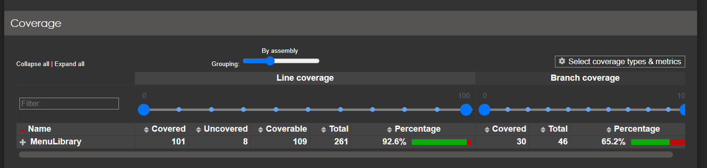
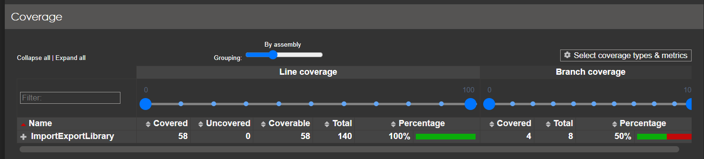
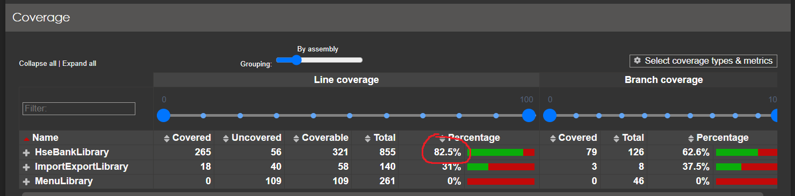
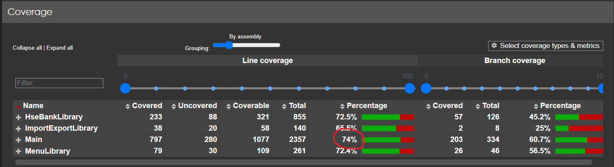

 <a href="https://github.com/Mi-Kram/HSE-Software-Engineering/tree/main" alt="General"> Главная страница </a> 

# КПО, КР №01

## a. Общая идея вашего решения (какой функционал реализовали, особенно если вносили изменения в функциональные требования).

Весь функционал реализован.

1. **Общая идея:** \
Создать набор максимально независимых инструментов и уже отпираясь от задачи формировать необходимые зависимости. Таким образом решение содержит 4 проекта:
    - `MenuLibrary`: отвечает за вывов меню и вызод команд-обработчиков.
    - `ImportExportLibrary`: отвечает за сериализацию и десериализацию в различные форматы (Json, Csv, Yaml).
    - `HseBankLibrary`: содержит необходимые модели, сервисы для хранения и подключения.
    - `Main`: непостредственно запускаемый проект, которые использует инструменты из библиотек выше. _Возможно было бы неплохо разбить `Main` на 2 проекта, где второй проект был бы по типу ConsoleUI. Но работа и без того получилась, скажем так, немного большего объёма, чем планировалось._

2. **Принцип работы программы:** \
Программа работает с файлами, которые размещены вместе с запускаемым файлом. Если файлов нет, программа запускается без начальных данных. Если файлы некорректные, программа сообщает, что не смогла прочитать данные. Для смены набора данных есть функционал импорта/экспорта данных. При импорте данных, старые данные перезаписываются, поэтому если важно их сохранить, то предварительно надо сделать экспорт в другую папку (отличную от той, где лежит исполняемый файл).

3. **Изменение в условии:**
    - поле `type` (доход/расход), было удалено из категории и оставлено только в типе `Operation`. Это было заранее согласовано с Людмилой Александровной.
    - Так поле `type` может принимать лишь 2 значения, оно было переименовано в `isIncome`, тип которого `bool`.

## b. Опишите какие принципы из SOLID и GRASP вы реализовали, скажите в каких классах (модулях).

1. **Пояснения применения принципов SOLID.**
 - **S – Single Responsibility** \
   Возможно из-за желания поддерживать этот принцип, проект получился таким большим. Всё же, путь если и не все, то значительная часть классов и методов выполняет данный принцип (`обработка, хранение, вывод` / `меню, хранилище, парсер`: весь код разбит на логические "блоки").

 - **O — Open-Closed** \
   Функционал легко добавляет и исключается при необходимости. Это достигается за счёт реализации обработчиков пользовательского ввода отдельными классами. Таким образом, имеющийся функционал легко расширять и добавлять новый.

 - **L — Liskov Substitution** \
   В проект легко вносить функционал, так как базовые вещи реализованы через интерфейсы и могут быть заменены другой реализацией.

 - **I — Interface Segregation** \
   Яркий пример в моём проекте — это куча репозиториев, которые обеспечивают хранение и получение данных. Все они строятся на базе интерфейса `IStorage`. \
   А также можно сказать про доменные модели, которые реализуют `IEntity<T_ID, T, T_DTO>`, где:
   - `T_ID` — это тип идентификатора сущности.
   - `T` — это тип самой сущности.
   - `T_DTO` — это тип модели данных для   передачи    (`Data Transfer Object`).

   Вместе эти вещи дают мощную структуру для хранения различных объектов. Т.е. не надо создавать отдельный тип репозитория для хранения разных типов сущностей.

2. **Пояснения применения принципов GRASP.** \
   По условию просили выполнить два принципа: `High Cohesion` и `Low Coupling`:

   - `Low Coupling` — работа состоит из 4 проектов и множества файлов внутри, выполняя при этом логически разные задачи. 

   - `High Cohesion` — также есть классы, которые объединяют некоторый функционал. Как правило, это связано с хранением и обработкой какой-либо информации. В моём примере это: \
       - репозитории (`IStorage`) — операции чтения, добавления,        удаления, обновления.
       - меню: вывод пунктов меню, выбор действия, запуск обработчика.
       - Также функционал разделён на области видимости, например: разные проекты выполняют свою задачу; обработчики пользовательских сценариев расположены в раздельных областях видимости (`namespace`).

## c. Опишите какие паттерны GoF вы реализовали, обоснуйте их важность, скажите в каких классах (модулях) они реализованы.

1. **Фасад** 
   - репозитории (`IStorage` и все его производные реализации)
   - `Database` — объединение необходимых репозиториев
   - проекты `ImportExportLibrary` и `MenuLibrary` — являются независимыми, выполняют конкретный функционал, легко могут быть перенесены в другой проект.

2. **Команда + декоратор**
   - обработчик меню `ICommand<Arg>` — содержит метод Execute() для выполнения какой-либо задачи. Хорошо подходит для реализации пользовательских сценариев.
   - Дополнение к  `ICommand<Arg>` является реализация этого интерфейса `TimingDecorator`, который оборачивает настоящий обработчик и во время его исполнения, засекает время.

3. **Шаблонный метод** \
   Реализован плохо, но немного похож:
   - абстрактный обработчик `ExportFileCotroller`. Он заставляет реализовать метод `Parse()` для обработки входных данных. 

4. **Фабрика**
   - `IDomainFactory` — создание доменных моделей.

5. **Абстрактная Фабрика**
   - `IParserGenerator` — создание парсеров для различных типов данных конкретного формата.

6. **Строитель**
   - `Database.Builder` — контролирует корректное создание группы репозиториев.

7. **Прокси**
   - `CachedStorage` — оборачивает настоящий репозиторий для кэширования данных.

---

## Для хранение и получения сервисов использовался DI-контейнер

## Код покрыт тестами на:
  - `MenuLibrary:`  **92.6%**

    

  - `ImportExportLibrary:`  **100%**

    

  - `HseBankLibrary:`  **82.5%**
 
    

 - `Main:`  **74%**

    

  В среднем тесты покрыты на `87%`.

## Тестовые данные лежат в папке `./backup`
Всё содержимое этой папки необходимо закинуть в папку с исполняемым файлом. По умолчанию, эти файлы там будут.
