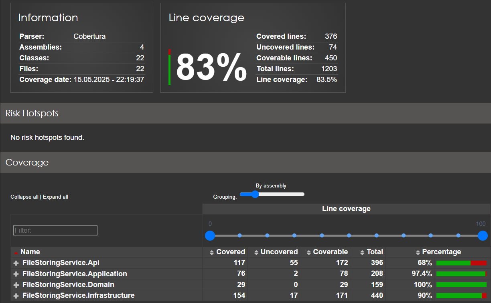
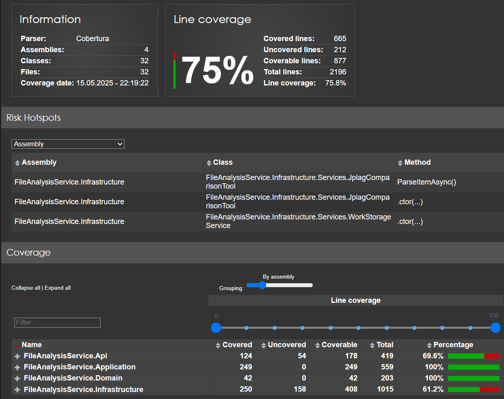
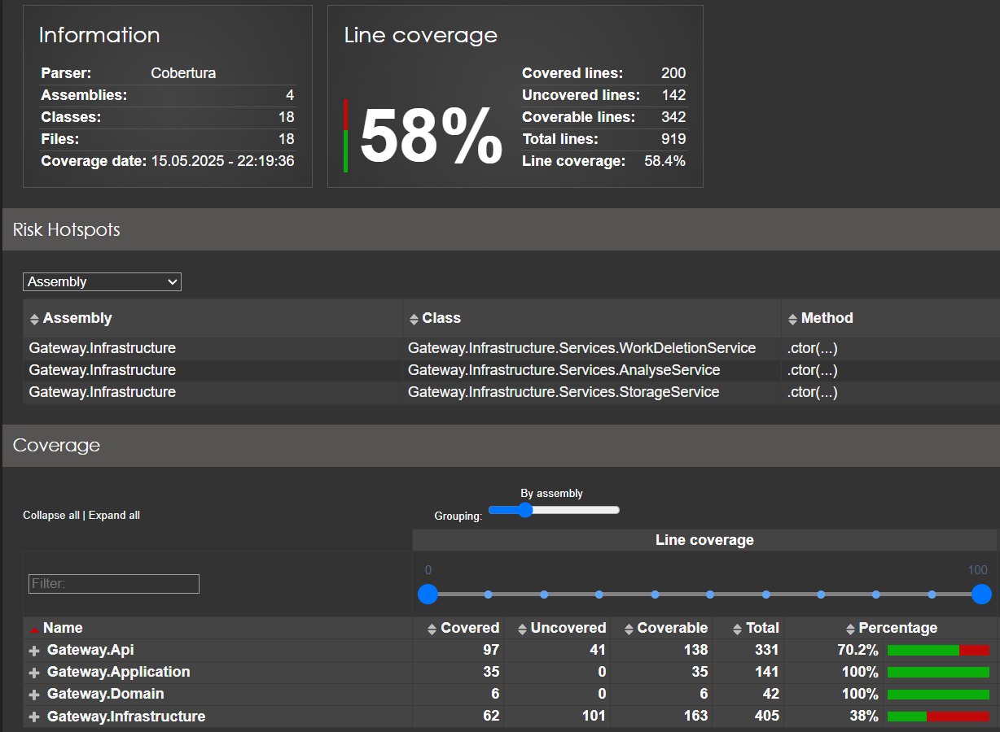

<p style="text-align: right"> <a href="https://github.com/Mi-Kram/HSE-Software-Engineering/tree/main" alt="General"> Главная страница </a> </p>

# КПО, КР №02

## Запуск программы

Файл `compose.yaml` содержит уже всю необходимую конфигурацию для запуска программы. Для запуска необходимо запустить `Docker compose`: 

```bash
docker compose up -d
```

Тестовые файлы лежат в каталоге:
`./docs/texts/`.

Взаимодействие с программой:
1. `localhost:8080/swagger` — главное управление программой.
2. `localhost:5000` — **pgAdmin** — администрирование базы банных
(логин пароль брать из `compose.yaml`).
3. `localhost:9001` — **S3 хранилище Minio** — администрирование хранилища работ:
хранение самих работ и картинок облаков слов (логин пароль брать из `compose.yaml`).

---

## Сервисы

### 1. Сервис хранения работ

Задачи сервиса:

1. Хранить загруженные работы.
   
   Приложение хранит следующую информацию о работе:
   - **id работы**;
   - **id владельца работы**;
   - **имя работы**;
   - **хэш работы**;
   - **время загрузки работы**.

   Для хранения непосредственно самой работы используется S3 хранилище `Minio`.

2. Следить, чтобы у одного владельца не была загружена одна и та же работа дважды.

   Для оптимизации этой задачи вычисляется хэш работы. При загрузке новой работы её хэш сравнивается с хэшами других работ. 
   
   Таким образом устанавливаются работы с одинаковым хэшем и владельцем. Такие работы сравниваются друг с другом. 
   
   Если выясняется, что работа была уже загружена, то возвращается `id` ранее загруженной работы.

3. Не обрабатывать неавторизованные запросы.

### 2. Сервис анализа работ

Задачи сервиса:

1. Подсчёт и хранение статистики.
   
   В качестве статистики вычисляются:
   - **количество абзацев**;
   - **количество слов** — последовательность символов, состоящей из букв и цифр;
   - **количество чисел** — последовательность символов, состоящей цифр;
   - **количество символов** — количество не пробельных символов;

2. Выявление и хранение информации о плагиате.
   
   В качестве плагиата вычисляется только процент заимствований.

   Для определения процента заимствований используется библиотека [`JPlag`](https://github.com/jplag/JPlag).

   Если провести анализ с помощью `JPlag` не удалось, применяется проверка, предложенная в условии задания: проверка на полное сходство работы.

3. Генерация облака слов.
   
   Для генерации используется API [`quickchart.io`](https://quickchart.io/documentation/word-cloud-api).

   Сгенерированные картинки хранятся в S3 хранилище `Minio`.

4. Не обрабатывать неавторизованные запросы.

### 3. Сервис распределения запросов

Задачи сервиса:

   1. Перенаправлять запросы.

      В зависимости от запроса, сервис обращается либо к Сервису для хранения работ, либо к Сервису для анализа работ, либо к ним обоим.

      Для эффективности работы сервиса реализовано **проксирование** запросов.
   
   2. Добавлять в заголовок запроса к сервисам токен доступа для авторизации сервиса.

---

## Используемые технологии/сервисы/библиотеки:
1. Backend: **`Asp.Net Core`** — фреймворк для создания веб-приложений;

2. База данных: **`PostgreSql`** — хранение метаданных работ, статистики о работах, плагиата между работами. Для взаимодействия с базой данных используется **`Entity Framework Core`**. Для администрирования базы данных — **`PgAdmin`**;

3. Хранение файлов: **S3 хранилище `Minio`** — система хранения файлов (работы, картинки облака слов);

4. Сервис генерации облака слов: [`quickchart.io`](https://quickchart.io/documentation/word-cloud-api/);

5. Анализ работ на плагиат: [`JPlag`](https://github.com/jplag/JPlag).

6. Контейнеризация: **`Docker`**.

---

## Сервис хранения работ `FileStoringService`

1. **Http запросы**

   - `GET: /api/works` — список всех работ.
   - `GET: /api/works/{id}` — файл работы с указанным `id`.
   - `Post: /api/works` — загрузка новой работы.
   - `Delete: /api/works` — удаление работы по `id`.

2. **Middleware**

   - `Middleware авторизации` — перед тем, как передавать обрабатывать запрос, проверяется наличие поля `token` в заголовках запроса. Если такого токена нет или токен неизвестен, в ответ на запрос возвращается `StatusCode 401`.

   - `Middleware исключений` — вся обработка запроса помещается в `try-catch` и при исключении информация обрабатывается соответствующим образом.

3. **Переменные среды**

   Для передачи параметров приложения используются переменные среды:
   - `FStoring.TOKEN` — токен авторизации сервиса;
   - `FStoring.DB_CONNECTION` — строка подключения к базе данных;
   - `FStoring.SRORAGE_ADDRESS` — адрес сервиса для хранения файлов работ;
   - `FStoring.SRORAGE_LOGIN` — логин для сервиса для хранения файлов работ;
   - `FStoring.SRORAGE_PASSWORD` — пароль для сервиса для хранения файлов работ;
   - `FStoring.SRORAGE_BUCKET` — бакет для сервиса для хранения файлов работ;
   - `FStoring.SRORAGE_SSL` — использование `ssl` для сервиса для хранения файлов работ.

---

## Сервис анализа работ `FileAnalysisService`

1. **Http запросы**

   - `GET: /api/analyse?id=1&id=2` — получить статистку работ с указанным `id`.
   - `GET: /api/analyse/wordcloud/{id}?regenerate=false` — получить облако слов работы по `id`. Флаг `regenerate` является необязательным, он указывает надо ли перегенерировать картинку, если она уже была сгенерирована.
   - `Get: /api/compare?id1=1&id2=2&id1=1&id2=3&id1=2&id2=3` — получить отчёт сравнения работ. \
   - `Get: /api/compare/all?id=1&id=2&id=3` — получить отчёт сравнения работ (все ко всем). \
   Работы сравниваются друг с другом из массива `id`.
   - `Delete: /api/works/{id}` — удаление работы по `id`.

2. **Middleware**

   - `Middleware авторизации` — перед тем, как передавать обрабатывать запрос, проверяется наличие поля `token` в заголовках запроса. Если такого токена нет или токен неизвестен, в ответ на запрос возвращается `StatusCode 401`.

   - `Middleware исключений` — вся обработка запроса помещается в `try-catch` и при исключении информация обрабатывается соответствующим образом.

3. **Переменные среды**

   Для передачи параметров приложения используются переменные среды:
   - `FAnalysis.TOKEN` — токен авторизации сервиса;
   - `FAnalysis.DB_CONNECTION` — строка подключения к базе данных;
   - `FAnalysis.MAIN_SERVER` — адрес сервиса распределения запросов `Gateway`;
   - `FAnalysis.COMPARISON_FILE` — путь к файлу-библиотеке для анализа сравнения работ;
   - `FAnalysis.WordsCloud.SRORAGE_ADDRESS` — адрес сервиса для хранения картинок облака слов;
   - `FAnalysis.WordsCloud.SRORAGE_LOGIN` — логин для сервиса для хранения картинок облака слов;
   - `FAnalysis.WordsCloud.SRORAGE_PASSWORD` — пароль для сервиса для хранения картинок облака слов;
   - `FAnalysis.WordsCloud.SRORAGE_BUCKET` — бакет для сервиса для хранения картинок облака слов;
   - `FAnalysis.WordsCloud.SRORAGE_SSL` — использование `ssl` для сервиса для хранения картинок облака слов.

4. **Взаимодействие с другими сервисами**

   Для получения работы отправляется запрос на сервис перенаправления запросов `Gateway`. Т.е. сервис получает работу не на прямую от сервиса хранения работ, а через посредника. Это сделано для централизации системы хранения и обмена файлами.

---

## Сервис распределения запросов `Gateway`

1. **Http запросы**

   - `GET: /api/works` — список всех работ.
   - `GET: /api/works/{id}` — файл работы с указанным `id`.
   - `Post: /api/works` — загрузка новой работы.
   - `Delete: /api/works` — удаление работы по `id`;

   <br>

   - `GET: /api/analyse?id=1&id=2` — получить статистку работ с указанным `id`.
   - `GET: /api/analyse/wordcloud/{id}?regenerate=false` — получить облако слов работы по `id`. Флаг `regenerate` является необязательным, он указывает надо ли перегенерировать картинку, если она уже была сгенерирована.
   - `Get: /api/compare?id1=1&id2=2&id1=1&id2=3&id1=2&id2=3` — получить отчёт сравнения работ. \
   - `Get: /api/compare/all?id=1&id=2&id=3` — получить отчёт сравнения работ (все ко всем). \
   Работы сравниваются друг с другом из массива `id`.

2. **Middleware**

   - `Middleware исключений` — вся обработка запроса помещается в `try-catch` и при исключении информация обрабатывается соответствующим образом.

3. **Переменные среды**

   Для передачи параметров приложения используются переменные среды:
   - `FGateway.STORAGE_TOKEN` — токен авторизации сервиса хранения работ;
   - `FGateway.STORAGE_SERVER` — адрес сервиса хранения работ;
   - `FGateway.ANALYSE_TOKEN` — токен авторизации сервиса анализа работ;
   - `FGateway.ANALYSE_SERVER` — адрес сервиса анализа работ.

---

## Качество кода

1. **`Clean Architecture`**. Все проекты соблюдают чистую архитектуру кода. Соблюдаются принципы **`SOLID`**.

2. Код закомментирован документирующими комментариями.

3. **`XUnit`**. Код покрыт авто-тестами:
   
   - `FileStoringService` — `83%`

     

   - `FileAnalysisService` — `75%`

     

   - `Gateway` — `58%`

     

   - **Среднее: `72%`**
