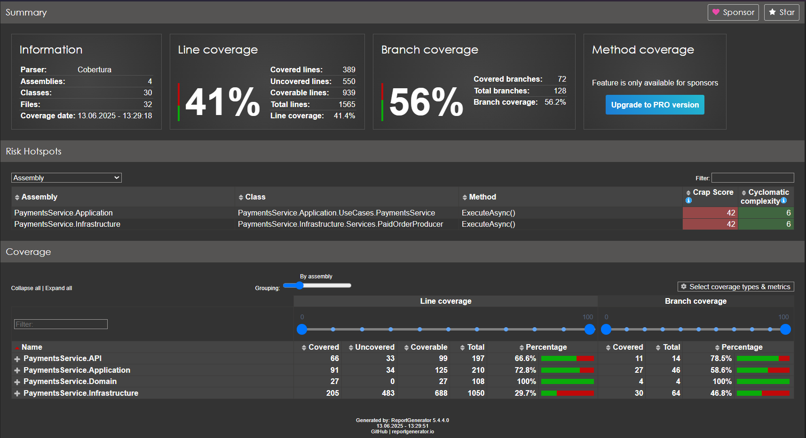
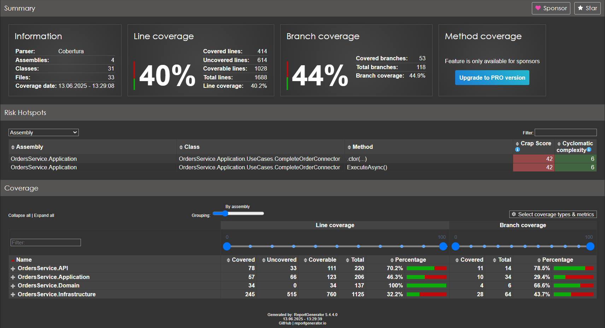
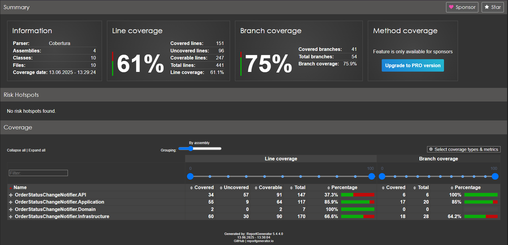

<p style="text-align: right"> <a href="https://github.com/Mi-Kram/HSE-Software-Engineering/tree/main" alt="General"> Главная страница </a> </p>

# КПО, КР №03

## Запуск программы

Файл `compose.yml` содержит уже всю необходимую конфигурацию для запуска программы. Для запуска необходимо запустить `Docker compose`: 

```bash
docker compose up -d
```

Взаимодействие с программой:
1. `localhost:8080/swagger` — управление программой через swagger.
2. `localhost:5000` — **Веб сайт** — управление счетами и заказами, а также демонстрация работы `WebSocket` для обновления информации о статусе заказа.
2. `localhost:5001` — **pgAdmin** — администрирование баз банных
3. `localhost:5002` — **RedPanda** — администрирование `Kafka`.

---

## Сервисы

### 1. Сервис счетов

Задачи сервиса:

1. Управление счетами:
   - Создание счета
   - Получение информации о всех счетах
   - Получение информации о счете по `id`
   - Пополнение счета

2. Оплата заказов.

### 2. Сервис заказов

Задачи сервиса:

1. Управление заказами.
   - Создание заказа
   - Получение информации о всех заказах
   - Получение информации о всех заказах пользователя
   - Получение информации о заказе по `id`.

### 3. Сервис уведомлений о изменении статуса заказа по `WebSocket`

Задачи сервиса:

1. Отправлять информацию подключившимся клиентам о изменении статуса заказа по `WebSocket`.

### 4. Сервис распределения запросов

Задачи сервиса:

1. Перенаправлять запросы на соответствующий сервис.

### 5. Сервис Веб клиент

Задачи сервиса:

1. Предоставить веб интерфейс для управления счетами и заказами.

---

## Используемые технологии:
1. Backend: **`Asp.Net Core`** — фреймворк для создания веб-приложений. Для тестирования API используется **`Swagger`**;

2. База данных: **`PostgreSql`**. Для взаимодействия с базой данных используется **`Entity Framework Core`**. Для администрирования базы данных — **`PgAdmin`**. Добавлены миграции;

3. Взаимодействие сервисов: **`Kafka + ZooKeeper`**. Для администрирования и мониторинга сервиса используется `docker.redpanda.com/redpandadata/console`.

4. Веб клиент: **`React + Nginx + MaterialUI`**.

5. Контейнеризация: **`Docker`**.

---

## Сервис счетов `PaymentsService`

1. **Http запросы**
   - `GET: /api/accounts` — список всех счетов.
   - `GET: /api/accounts/{id}` — счет с указанным `id`.
   - `Post: /api/accounts` — создание нового счета.
   - `Patch: /api/accounts/top-up` — поплнение баланса счета.

2. **Переменные среды**

   Для передачи параметров приложению используются переменные среды:
   - `PaymentsService.DB_CONNECTION` — строка подключения к базе данных;
   - `PaymentsService.KAFKA` — адрес подключения к брокеру сообщений;
   - `PaymentsService.TOPIC_NEW_ORDER` — названия темы для сообщений о создании нового заказа;
   - `PaymentsService.TOPIC_PAID_ORDER` — названия темы для сообщений об оплате заказа;

---

## Сервис заказов `OrdersService`

1. **Http запросы**

   - `GET: /api/orders` — список всех заказов.
   - `GET: /api/orders/by_user/{user_id}` — список всех заказов пользователя.
   - `GET: /api/orders/{id}` — заказ с указанным `id`.
   - `Post: /api/orders` — создание нового заказа.

2. **Переменные среды**

   Для передачи параметров приложению используются переменные среды:
   - `OrdersService.DB_CONNECTION` — строка подключения к базе данных;
   - `OrdersService.KAFKA` — адрес подключения к брокеру сообщений;
   - `OrdersService.TOPIC_NEW_ORDER` — названия темы для сообщений о создании нового заказа;
   - `OrdersService.TOPIC_PAID_ORDER` — названия темы для сообщений об оплате заказа;

---

## Сервис уведомдений о изменении статуса заказа по WebSocket `OrderStatusChangeNotifier`

Подключение по `WebSocket` осуществляется по запросу `/ws`. По установленному соединению, при получении информации об обновлении статуса заказа, сервер посылает сообщение в формате `"{order_id};{status}"`.

---

## Межсервисное взаимодействие & обработка сообщений

Для взаимодействия сервисов счетов и заказов используется `Kafka`.
Реализована семантика **`exactly once`**.

Для отправки и обработки сообщений реализованы паттерны **`Transactional Outbox`** и **`Transactional Inbox`** для двух сервисов.

Для семантики **`exactly once`** предусмотрена ситуация, когда запущено несколько реплик сервиса, т.е. существует несколько фоновых процессов-обработчиков сообщений (например, для оплаты заказа):

1. Добавлен столбец `reserved` — время, до которого нельзя обрабатывать данное сообщение. Когда обработчик берёт сообщение на обработку, он выделяет некоторое время на его выполнение и устанавливает время, к которому он гарантированно завершит обработку, например на 1 минуту позже текущего времени. При обработке может случиться что угодно (например, компьютер внезапно выключили или он сломался). При достижении времени reserved, сообщение будет считаться актуальным к обработке и его сможет занять другой обработчик.

2. Так как доступ к базе данных ассинхронный может случиться так, что 2 обработчика в один момент времени возьмут одно и то же сообщение на обработку, и одновременно обновят поле `reserved`. Для избежании такого сценария была написана `sql-функция` котоая исполузует флаг `FOR UPDATE SKIP LOCKED` — при переборе записей из таблицы, если какая-то запись будет обрабатываться другим процессом, то она будет пропущена. Это гарантирует, что 2 разных процесса не возьмут на обработку одно и то же сообщение.

---

## Сервис распределения запросов `GatewayService`

Вся основная логика этого сервиса реализована при помощи Nuget-пакета `Yarp.ReverseProxy`. Приложение проксирует все запросы формата:

- `localhost/ws/**` -> `notifier-service/ws/**`
- `localhost/api/accounts/**` -> `accounts-service/api/accounts/**`
- `localhost/api/orders/**` -> `orders-service/api/orders/**`

Также написаны контроллеры для генерации Swagger-страницы. Сами контроллеры никогда запускаются, так как все запросы перехватывает и проксирует `Yarp.ReverseProxy`.

---

## Веб клиент `WebUI`

Реализовано 4 странички:

1. `/accounts` — страница счетов (страница по умолчанию).
2. `/orders` — страница заказов.
3. Страница неизвестной страницы (StatusCode 404).
4. Cтраница недоступности сервера, для быстрой проверки:

   ```bash
   docker compose up web-client
   ```

На странице `/orders` при создании нового заказа с помощью WebSocket обновляется статус заказа.

---

## Качество кода

1. **`Clean Architecture`**. Все проекты соблюдают чистую архитектуру кода.

3. **`XUnit`**. Код покрыт авто-тестами:
   
   - `PaymentsService` — `41%`

     

   - `OrdersService` — `40%`

     

   - `OrderStatusChangeNotifier` — `61%`

     

   - **Среднее: `47%`**
