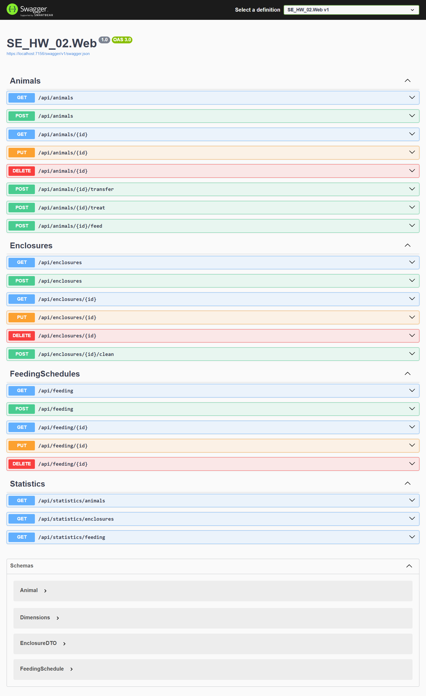
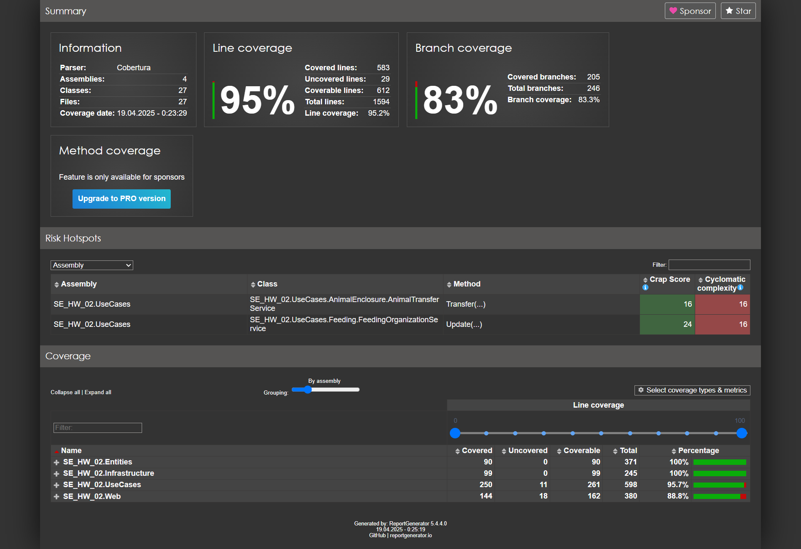

 <a href="https://github.com/Mi-Kram/HSE-Software-Engineering/tree/main" alt="General"> Главная страница </a> 

# КПО, Мини ДЗ №02

## 1. Применение Domain-Driven Design (DDD).

В приложении выделено 4 домена:
- Животные
- Вольеры
- Расписание кормлений
- Статистика

## 2. Применение Clean Architecture.

Каждый домен разбит на слои согласно принципам Clean Architecture:
- Domain Layer: определение основных сущностей
- UseCase Layer: определение бизнес-правил; определение интерфейсов для взаимодействия компонентов приложения
- Infrastructure Layer: реализация хранилищ сущностей в памяти (in-memory)
- Presentation Layer: контроллеры - адаптеры, которые преобразуют данные для удобной работы в UseCase слое.

Зависимости "строго во внутрь" и через интерфейсы:
- Domain Layer ни от чего не зависит
- UseCase Layer зависит от Domain Layer
- Infrastructure Layer зависит от Domain и UseCase Layer
- Presentation Layer зависит от Domain, UseCase и Infrastructure Layer

## 3. Контроллеры.

В приложении реализовано 4 контроллера:
- AnimalsController: для работы с животными
- EnclosuresController: для работы с вольерами
- FeedingSchedulesController: для работы с расписанием кормления
- StatisticsController: для работы со статистикой

## 4. Применение Swagger.

Для тестирования приложения использовалось:

- Swagger

  

- Юнит тесты (покрытие **95%**)

   Стоит отметить:
   - Тесты писались в одном проекте `SE_HW_02.Tests`.
   - Тесты могут не пройти с первого раза, в таком случае требуется перезапустить тесты. Такое поведение связано с ожиданием вывода информации в консоль о кормлении животного.

  

## 5. Размещение файлов.

- Сущности хранятся в каталога `SE_HW_02.Entities/Models`, они реализуют абстрактный класс `Entity`.

- Интерфейсы функционала приложения прописаны в проекте `SE_HW_02.UseCases` в каждом каталоге. Размещение интерфейсов в различных каталогах обуславливается поддержанием концепции DDD.

- Реализация интерфейсов функциональных сервисов (она же инкапсуляция бизнес правил) находится в том же каталоге, что и сам интерфейс в проекте `SE_HW_02.UseCases`.

- Реализация интерфейсов репозиториев находиться в каталоге `SE_HW_02.Infrastructure/Repositories`.

- Контроллеры находятся в каталоге `SE_HW_02.Web/Controllers`.

## 6. Функциональность.

В задании указаны требования, такие как: "переместить животное в другой вольер", "вылечить животное", "покормить животное", "почистить вольер". Однако не уточняется, какие действия должны сопровождать эти запросы и предполагается ли их фактическое выполнение в системе.

Исходя из этого, приложение реализовано как система учёта зоопарка. То есть, при получении запроса, например, "вылечить животное", оно помечается как "здоровое".

В качестве исключения был разработан дополнительный сервис кормления — `SE_HW_02.UseCases/Feeding/FeedingMasterService`, который имитирует процесс кормления, выводя информацию в консоль.

Такой подход демонстрирует, что архитектура приложения легко расширяема и позволяет при необходимости добавлять более сложную бизнес-логику без значительных изменений базовой структуры.

